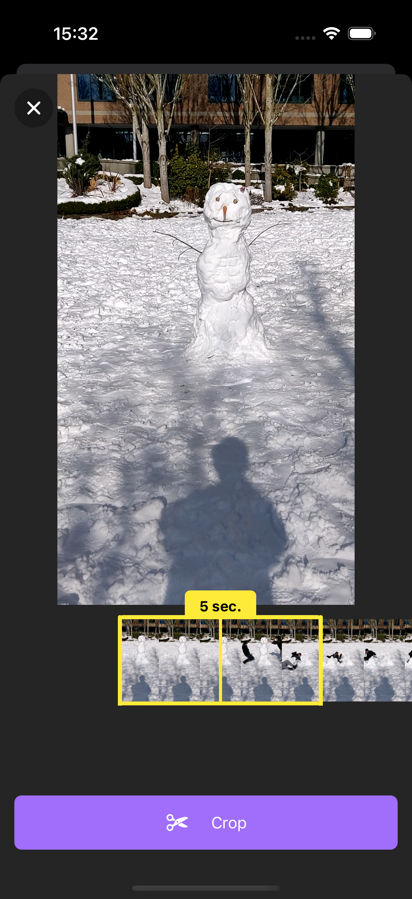

# Video Diary App 🎬

The Video Diary App is a React Native application that allows users to import videos, crop specific 5-second segments, add metadata (name and description), and save these clips for future reference.

## Features ✨

- **Video Importing**: Select videos from your device's library.
- **Video Cropping**: Trim videos to 5-second segments using a user-friendly interface.
- **Metadata Addition**: Assign a name and description to each cropped video.
- **Saved Clips**: View a list of saved video segments with their metadata.

## Screenshots 📸



## Technologies Used 🧑🏻‍💻

- **React Native**: Framework for building native apps using React.
- **Expo**: Toolset for developing, building, and deploying React Native apps.
- **Expo Router**: For implementing app navigation.
- **Zustand**: State management solution.
- **Tanstack Query**: Manages asynchronous logic and FFMPEG operations.
- **FFMPEG**: Library for video processing tasks.
- **NativeWind**: Styling solution for React Native.
- **Expo Video**: Component for video rendering and playback.

## Installation 🛠️

1. **Clone the repository**:

   ```bash
   git clone https://github.com/ekaynak94/video-diary-app.git
   cd video-diary-app
   ```

2. **Install dependencies**:

```bash
   npm install
```

3. **Start the app on iOS or Android**:

Since some features do not work with Expo Go, use the following commands to run the app in a full development environment:

- For iOS:

```bash
   npx expo run:ios
```

- For Android

```bash
   npx expo run:android
```

## Usage 📱

1. **Import a Video**: Use the "Create project" button to choose a video from your device.
2. **Crop the Video**: Adjust the scrubber to select a 5-second segment.
3. **Add Metadata**: Enter a name and description for the video segment.
4. **Save the Clip**: Save the cropped video to view it later in the home screen.
